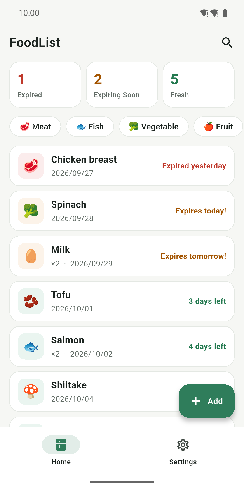
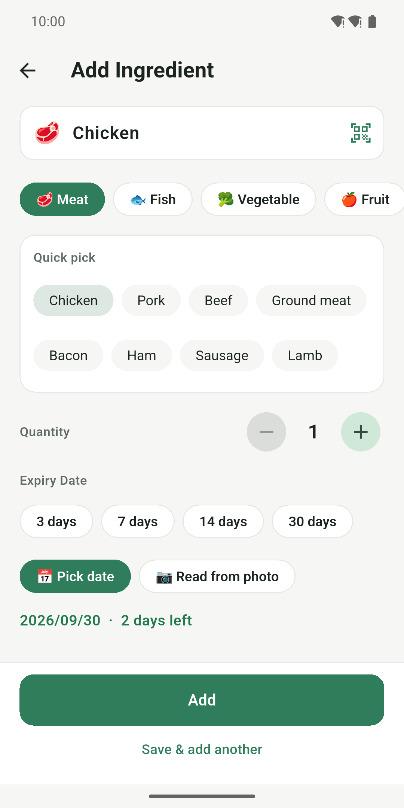
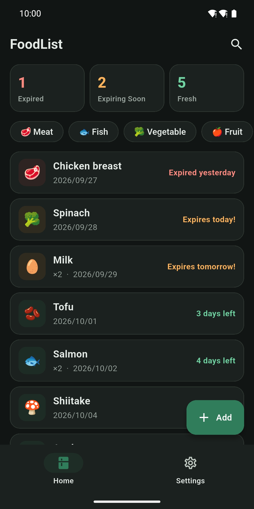

# FoodList

[](https://github.com/ForgerWise/FoodList/actions/workflows/ci.yml)
[](LICENSE)

**Use your food before it goes bad.** FoodList is a simple, free and open-source Android app that tracks what's in your fridge and reminds you before things expire. No account, no ads, and your data stays on your phone.

[](https://play.google.com/store/apps/details?id=com.forgerwise.foodlist)

<p>
  
  
  
</p>

## Features

- **Add in two taps** — pick from common foods (with typical shelf life) or your recent items; name, category and expiry are filled in for you.
- **Scan barcodes** — EAN / JAN / UPC, GS1 QR & DataMatrix (expiry date read automatically), supermarket in-store labels. Names you type are remembered.
- **See what matters** — red = expired, orange = expiring soon (range is adjustable), green = fresh. Tap a counter to filter.
- **Daily reminder** at a time you choose.
- **Your categories** — rename, reorder, pick emoji icons.
- Light & dark mode · English, 繁體中文, 日本語.

## Install

- [Google Play](https://play.google.com/store/apps/details?id=com.forgerwise.foodlist)
- APKs on the [Releases](https://github.com/ForgerWise/FoodList/releases) page

## Build from source

Requires Flutter 3.47.x and JDK 17.

```sh
flutter pub get
flutter run
# optional: Japanese product names via Yahoo! Shopping
cp dart_defines.example.json dart_defines.json   # put your Client ID inside
flutter run --dart-define-from-file=dart_defines.json
```

See [CONTRIBUTING.md](CONTRIBUTING.md) for checks, branches and release steps, [docs/ARCHITECTURE.md](docs/ARCHITECTURE.md) for how the code and stored data are organised, and [docs/DESIGN.md](docs/DESIGN.md) for the design guidelines.

## Data sources

Barcode lookups send only the barcode number:

- **[Open Food Facts](https://world.openfoodfacts.org/)** — product data © Open Food Facts contributors, available under the [Open Database License](https://opendatacommons.org/licenses/odbl/1-0/). Missing a product? [Add it](https://world.openfoodfacts.org/contribute) and everyone benefits.
- **Yahoo! Shopping (Japan)** — <a href="https://developer.yahoo.co.jp/sitemap/">Web Services by Yahoo! JAPAN</a>. Used for non-commercial purposes only, as required by the Yahoo! JAPAN developer guidelines.

## Privacy

FoodList collects no personal data. See the [Privacy Policy](Privacy-Policy.md).

## Background

FoodList started as a university PBL (Project-Based Learning) project on reducing household food loss. Thanks to everyone on the original team for their ideas and work.

## Contributing

Issues and pull requests are welcome — please read [CONTRIBUTING.md](CONTRIBUTING.md) first.

## License

[MIT](LICENSE) © ForgerWise · Contact: [forgerwise@gmail.com](mailto:forgerwise@gmail.com)
